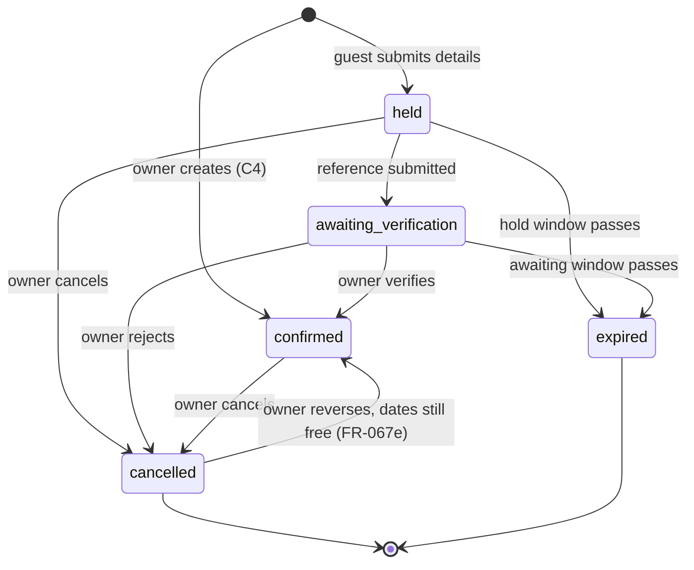

# Phase 1 — Data Model

**Feature**: 001-resort-direct-booking
**Date**: 2026-07-31 · **Revision 2** — C9–C13 and gate remediation
**Derives from**: `spec.md` Key Entities · `security-baseline.md` §1 (v1.1.0) · `research.md` R1–R17

**Changed since revision 1**: three new tables (`page_sections`, `gallery_categories`,
`personal_data_stores`), `gallery_images` restructured for two-surface ordering, `content_pages`
gained menu and kind columns, `site_settings` gained seven settings, and `updated_at` added
throughout for R13.

---

## Entity relationship diagram

Cardinality is explicit on every relationship, with reasoning below the diagram — several are
decisions rather than obvious consequences.

```mermaid
erDiagram
    AUTH_USERS   ||--|| ADMIN_USERS          : "is"
    ADMIN_USERS  ||--o{ BOOKING_EVENTS       : "acts in"

    ROOM_TYPES   ||--o{ ROOM_UNITS           : "is realised by"
    ROOM_TYPES   ||--o{ RATE_OVERRIDES       : "is repriced by"
    ROOM_TYPES   ||--o{ GALLERY_IMAGES       : "is illustrated by"

    GALLERY_CATEGORIES ||--o{ GALLERY_IMAGES : "groups"

    ROOM_UNITS   ||--o{ BOOKINGS             : "is reserved by"
    ROOM_UNITS   ||--o{ AVAILABILITY_BLOCKS  : "is withheld by"
    ROOM_UNITS   ||--o{ ROOM_OCCUPANCY       : "is claimed in"

    BOOKINGS            ||--|| ROOM_OCCUPANCY : "claims"
    AVAILABILITY_BLOCKS ||--|| ROOM_OCCUPANCY : "claims"

    BOOKINGS     ||--|{ BOOKING_EVENTS       : "is journalled by"
    BOOKINGS     ||--o{ EMAIL_DELIVERIES     : "is notified by"

    SITE_SETTINGS ||--|| SITE_BRANDING       : "is paired with"

    ADMIN_USERS {
        uuid user_id PK_FK
        text role
        timestamptz created_at
    }
    ROOM_TYPES {
        uuid id PK
        text name
        text slug UK
        text description
        text bed_configuration
        int  max_occupancy
        numeric base_nightly_rate
        int  sort_order
        timestamptz published_at
        timestamptz archived_at
        timestamptz updated_at
    }
    ROOM_UNITS {
        uuid id PK
        uuid room_type_id FK
        text label
        int  sort_order
        bool active
        timestamptz updated_at
    }
    RATE_OVERRIDES {
        uuid id PK
        uuid room_type_id FK
        text label
        daterange date_range "EXCLUDE with room_type_id"
        numeric nightly_rate
        timestamptz updated_at "optimistic lock"
    }
    ROOM_OCCUPANCY {
        uuid id PK
        uuid room_unit_id FK
        text source "booking|block"
        uuid booking_id FK "nullable, unique"
        uuid block_id FK "nullable, unique"
        daterange stay_range "EXCLUDE with room_unit_id"
    }
    BOOKINGS {
        uuid id PK
        uuid room_unit_id FK
        text booking_reference UK
        text status
        text origin "online|owner, server-derived"
        date check_in
        date check_out
        int  guests
        text guest_name "personal"
        citext guest_email "personal, null when origin=owner"
        text guest_phone "personal"
        text guest_notes "personal"
        text payment_reference
        numeric stay_total "frozen at write"
        numeric amount_received
        text owner_notes
        timestamptz hold_expires_at
        timestamptz erased_at
        timestamptz updated_at "optimistic lock"
    }
    AVAILABILITY_BLOCKS {
        uuid id PK
        uuid room_unit_id FK
        text reason "never public"
        daterange date_range
        timestamptz updated_at "optimistic lock"
    }
    BOOKING_EVENTS {
        uuid id PK
        uuid booking_id FK
        uuid actor_id FK "null means system"
        text event_type
        jsonb previous_values "CHECK no personal keys"
        jsonb new_values "CHECK no personal keys"
        timestamptz created_at
    }
    EMAIL_DELIVERIES {
        uuid id PK
        uuid booking_id FK
        text message_kind
        citext recipient "personal"
        text provider_message_id UK
        text outcome
        timestamptz created_at
    }
    ENQUIRIES {
        uuid id PK
        text full_name "personal"
        citext email "personal"
        text message "personal"
        text status
        text owner_note
        timestamptz created_at
    }
    GALLERY_CATEGORIES {
        uuid id PK
        text name
        text slug UK
        int  position
        bool is_shipped
        timestamptz updated_at
    }
    GALLERY_IMAGES {
        uuid id PK
        uuid category_id FK
        uuid room_type_id FK "nullable"
        text storage_path
        text alt_text "required"
        int  gallery_position
        int  room_position "nullable"
        timestamptz published_at
        timestamptz updated_at
    }
    CONTENT_PAGES {
        uuid id PK
        text slug UK
        text page_kind "content|policy"
        text title
        text menu_label "nullable"
        int  menu_position
        text body_markdown
        timestamptz published_at
        timestamptz updated_at
    }
    PAGE_SECTIONS {
        uuid id PK
        text page "home|room_detail"
        text section_type
        bool enabled "CHECK true when required"
        int  position
        timestamptz updated_at
    }
    PERSONAL_DATA_STORES {
        text table_name PK
        text[] personal_columns
        text disposition "anonymise|delete"
        text key_column
    }
    SITE_SETTINGS {
        bool id PK "singleton"
        text property_name
        text address
        numeric latitude
        numeric longitude
        text transport_notes "Markdown, no raw HTML"
        text contact_phone
        citext contact_email
        text payment_qr_path "private bucket"
        text deposit_guidance
        text timezone "IANA"
        int  hold_minutes
        int  awaiting_hours
        int  min_notice_hours
        int  same_day_cutoff_hour
        int  session_idle_minutes
        int  booking_retention_months
        int  enquiry_retention_months
        int  scarcity_threshold "0 disables"
        text hero_treatment "image|video|depth"
        jsonb rate_limits
    }
    SITE_BRANDING {
        bool id PK "singleton"
        text primary_hex
        text secondary_hex
        text primary_text_hex "derived"
        text on_primary_hex "derived"
        text logo_wide_path
        text logo_inverse_path
        text og_image_path
    }
```

### Why each cardinality is what it is

| Relationship | Cardinality | Reasoning |
|---|---|---|
| `auth_users → admin_users` | **1 : 1** | Exactly one owner per deployment (C3). FR-069g forbids disabling it, so there is no `disabled_at` — a field that could brick a deployment does not exist rather than existing unused |
| `admin_users → booking_events` | **1 : 0..N** | A fresh deployment has an owner who has done nothing yet |
| `room_types → room_units` | **1 : 0..N** | **Zero is deliberate.** A room type being drafted has no units and never appears in availability. Forcing ≥1 would block the owner mid-edit |
| `room_types → rate_overrides` | **1 : 0..N** | Most room types have no seasonal variation |
| `room_types → gallery_images` | **1 : 0..N** | Nullable FK — an image belongs to a room type *or* is general property photography (C11) |
| `gallery_categories → gallery_images` | **1 : 0..N** | An empty category is legal and hides itself (FR-041f) rather than being forbidden |
| `room_units → bookings` | **1 : 0..N** | Overlap is prevented by constraint, not by cardinality |
| `room_units → room_occupancy` | **1 : 0..N** | Zero when a unit has never been claimed |
| `bookings → room_occupancy` | **1 : 1** | Exactly one claim per booking. **One room per booking (C2) is enforced structurally here**, not by convention |
| `availability_blocks → room_occupancy` | **1 : 1** | Same shape, different source — which is what lets one constraint govern both (R2) |
| `bookings → booking_events` | **1 : 1..N** | **Never zero.** Creation always writes an event, so an empty history is a violation the model can express |
| `bookings → email_deliveries` | **1 : 0..N** | Zero for a walk-in with no email (FR-021e); many when resends occur (FR-018e) |
| `site_settings → site_branding` | **1 : 1** | Both singletons, seeded together |

`enquiries`, `content_pages`, `page_sections`, `personal_data_stores`, `rate_limit_events`, and
`webhook_events` have no foreign keys by design.

---

## The three structural decisions

### 1. `room_occupancy` — one constraint over two sources

FR-004 prevents two bookings overlapping. FR-037 **and now FR-037a** additionally require that a block
and a booking cannot both claim the same unit and dates — on creation *or* on change. A Postgres
exclusion constraint governs one table, so two tables cannot share one guarantee.

```sql
create extension if not exists btree_gist;

create table public.room_occupancy (
  id           uuid primary key default gen_random_uuid(),
  room_unit_id uuid not null references public.room_units(id) on delete restrict,
  source       text not null check (source in ('booking','block')),
  booking_id   uuid unique references public.bookings(id) on delete cascade,
  block_id     uuid unique references public.availability_blocks(id) on delete cascade,
  stay_range   daterange not null,
  constraint occupancy_source_matches check (
    (source = 'booking' and booking_id is not null and block_id is null) or
    (source = 'block'   and block_id  is not null and booking_id is null)
  ),
  constraint occupancy_no_overlap
    exclude using gist (room_unit_id with =, stay_range with &&)
);
```

**This one constraint discharges FR-004, FR-037, FR-037a, and SC-001 together**, across all four
writers, with no code path able to opt out. **FR-037a costs nothing**: a block whose dates change
re-projects its occupancy row in the same transaction, and the constraint adjudicates the move exactly
as it adjudicates a creation.

### 2. `page_sections` — updatable, never creatable

```sql
create table public.page_sections (
  id           uuid primary key default gen_random_uuid(),
  page         text not null check (page in ('home','room_detail')),
  section_type text not null,
  enabled      boolean not null default true,
  position     int not null,
  updated_at   timestamptz not null default now(),
  unique (page, section_type),
  -- FR-050c / FR-033b: the availability search cannot be switched off
  constraint availability_always_enabled check (
    section_type not in ('availability_search','room_availability') or enabled
  )
);
```

Rows are seeded from the template's catalogue. **No client may insert or delete** — that is what makes
C10 "fixed sections the owner arranges" rather than a page builder. The undisableable section is a
check constraint, not a hidden toggle: a rule enforced only in the interface survives until someone
calls the API directly.

### 3. `personal_data_stores` — the register as a real object

```sql
create table public.personal_data_stores (
  table_name       text primary key,
  personal_columns text[] not null,
  disposition      text not null check (disposition in ('anonymise','delete')),
  key_column       text not null
);

insert into public.personal_data_stores values
  ('bookings',         array['guest_name','guest_email','guest_phone','guest_notes'], 'anonymise', 'guest_email'),
  ('email_deliveries', array['recipient'],                                            'anonymise', 'recipient'),
  ('enquiries',        array['full_name','email','message'],                          'delete',    'email');
```

FR-026b says a rule naming individual stores instead of the register is defective by construction —
**which is only true if the register is a real object.** A register that exists as prose is one someone
forgets to update, and that is precisely how this defect recurred three times.

Erasure, export, and retention iterate this table. Adding a store is a row, added by the same migration
that adds the personal column.

---

## Validation rules

| Table | Rule |
|---|---|
| `bookings` | `check_out > check_in`; span ≤30 nights; `guests` 1..`room_type.max_occupancy`; `status` enum; `origin` enum; `amount_received >= 0`; `guest_email` required when `origin = 'online'` |
| `bookings` | `booking_reference` ≥10 chars Crockford base32, unique, non-sequential (FR-005a) |
| `rate_overrides` | `nightly_rate > 0`; **`exclude using gist (room_type_id with =, date_range with &&)`** (FR-029b) |
| `availability_blocks` | `reason` 1–200 chars; overlap governed by `room_occupancy` (FR-037, FR-037a) |
| `room_types` | `max_occupancy` 1–20; `base_nightly_rate > 0`; `slug ~ '^[a-z0-9-]{1,80}$'` |
| `gallery_images` | `alt_text` not null, 1–300 chars (FR-068b); `room_position` not null when `room_type_id` is set |
| `gallery_categories` | `slug` unique; deletion refused while images remain (FR-041e) |
| `content_pages` | `slug ~ '^[a-z0-9-]{1,80}$'`; no raw HTML in `body_markdown` (FR-045a); delete refused when `page_kind = 'policy'` (FR-059) |
| `page_sections` | `availability_always_enabled` above |
| `site_settings` | `timezone` a valid IANA name; `same_day_cutoff_hour` 0–23; retention months > 0; `scarcity_threshold >= 0` |
| `site_branding` | hex `~ '^#[0-9A-Fa-f]{6}$'`; contrast enforced in the Edge Function |
| `booking_events` | no personal keys in either JSONB column (FR-022g) |

```sql
alter table public.booking_events add constraint booking_events_no_personal_fields check (
  not (previous_values ?| array['guest_name','guest_email','guest_phone','guest_notes'])
  and
  not (new_values      ?| array['guest_name','guest_email','guest_phone','guest_notes'])
);
```

### Optimistic concurrency (R13, FR — CHK035)

`bookings`, `rate_overrides`, and `availability_blocks` require a matching `updated_at` from the
caller; a mismatch raises `stale_record`. Every other owner-editable table is last-write-wins. Those
three are where a silently lost update costs money or a double-booking; the rest cost a retype.

---

## State transitions



Every transition is executed by `public.write_booking()` and nothing else (R1). **"Available" is not a
state** (FR-015a) — it describes a unit with no live occupancy row, and is derived rather than stored.

Entering `cancelled` or `expired` deletes the occupancy row, which is what returns the dates.
**FR-067e's reversal re-inserts it**, and therefore fails if another booking took the dates
meanwhile — which is the correct behaviour and needs no extra rule.

---

## Erasure and retention

Both iterate `personal_data_stores`. One function, two triggers.

| Data | Trigger | Disposition |
|---|---|---|
| `bookings` personal columns | Owner request (FR-027) or `booking_retention_months` after checkout | Anonymise in place; stamp `erased_at` |
| `email_deliveries.recipient` | Same | Anonymise; keep `message_kind` and `outcome` |
| `enquiries` | Owner request or `enquiry_retention_months` | Delete |
| `booking_events` | **Never** | Holds no personal columns by constraint |
| `rate_limit_events` | Past longest window | Delete |

Erasure is keyed on email address across all stores (FR-027), so a guest who booked twice and enquired
once is one action. SC-014 verifies by searching every store in the register.

---

## RLS assignment

Per `security-baseline.md` §1.3 as amended to v1.1.0.

| Table | Pattern | anon | authenticated (owner) |
|---|---|---|---|
| `site_settings` | **P1s** | SELECT public columns | UPDATE via RPC |
| `site_branding` | **P1s** | SELECT | **no direct write** — RPC only |
| `room_types` | **P1** | SELECT published, unarchived | full CRUD |
| `room_units` | **P4** | none | full CRUD |
| `rate_overrides` | **P1** | SELECT | CRUD via RPC (optimistic lock) |
| `availability_blocks` | **P4** | **none** — `reason` never public (FR-002a) | CRUD via RPC |
| `room_occupancy` | **P4** | none | SELECT only; written by RPC |
| `bookings` | **P4 + P5** | none | **SELECT only**; all writes via RPC |
| `booking_events` | **P7** | none | SELECT only |
| `email_deliveries` | **P7** | none | SELECT only |
| `enquiries` | **P3** | INSERT only, no read | SELECT/UPDATE/DELETE |
| `gallery_categories` | **P1** | SELECT | full CRUD |
| `gallery_images` | **P1** | SELECT published | full CRUD |
| `content_pages` | **P1 + delete guard** | SELECT published | CRUD, delete predicated on `page_kind <> 'policy'` |
| `page_sections` | **P1s-variant** | SELECT | **UPDATE only** — no insert, no delete (R14) |
| `personal_data_stores` | **P4** | none | none — read by `security definer` functions only |
| `admin_users` | **P4** | none | none |
| `rate_limit_events` | **P4** | none | none |
| `webhook_events` | **P4** | none | none |

**Guests read no table that could disclose occupancy.** `bookings`, `availability_blocks`, and
`room_occupancy` are all P4 with no anon policy — FR-002a enforced structurally rather than by
remembering to filter. A guest cannot tell whether a date is taken by a booking or a block because
they receive neither.

**The one deliberate exception is the scarcity count** (FR-002c, C14), and it is gated inside
`search_availability` rather than at the table. The function returns the true remaining count only at
or below `scarcity_threshold` and `null` above it, so the exact number never leaves the database on a
query that should not disclose it. Filtering in the client would put the occupancy curve in every
network response — visible to anyone who opens the network tab, which is the disclosure the threshold
exists to prevent.
